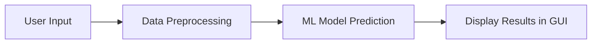

# Stock-market-analysis
Stock Price Prediction App Documentation

Project Name: Stock Price Prediction App  
Role: Technical Writer / Documentation Creator  
Date: October, 2025  
Version: 1.0
Author - Pratik Kumar

Table of Contents

1. Overview  
2. Purpose / Objective  
3. System Requirements  
4. Installation & Setup  
5. Features / Functionalities  
6. User Guide / Instructions  
7. Technical Details / Workflow  
8. Diagrams & Visuals  
9. Troubleshooting  
10. References / Resources  

1. Overview

This app helps you predict future stock prices using smart computer models called machine learning.  
You can type in a stock symbol (like AAPL for Apple), choose a time period, and see predictions and charts in your web browser.  
It’s designed for anyone interested in stocks, whether you’re a beginner or have experience.

Technologies Used:  
- Python: The programming language used to build the app.  
- Streamlit: Lets you run the app in your browser with an easy interface.  
- scikit-learn: Provides tools for machine learning and predictions.  
- Pandas: Handles and organizes stock data.  
- Plotly: Draws interactive charts and graphs.  
- yfinance: Downloads stock data from Yahoo Finance.

Audience:  
Anyone curious about stocks, investing, or learning how computers can help predict prices.


2. Purpose / Objective

- Help users see possible future trends in stock prices  
- Teach how machine learning can be used for predictions  
- Make stock analysis easy and accessible for everyone  
- Provide a safe space to experiment with stock data without risking real money


3. System Requirements

Hardware:  
- Any computer with at least 4GB RAM (most modern computers are fine)

Software:  
- Python 3.8 or newer  
- The libraries listed below

Libraries / Dependencies:  
- pandas  
- scikit-learn  
- plotly  
- numpy  
- yfinance  
- streamlit  
- openpyxl


4. Installation & Setup

Step-by-step instructions:

1. Install Python:  
   Download and install Python from [python.org](https://www.python.org/).

2. Install required libraries:  
   Open your command prompt (Windows) or terminal (Mac/Linux) and type:
   ```
   pip install pandas scikit-learn plotly numpy yfinance streamlit openpyxl
   ```

3. Download the project files:  
   Save all the files from this project to a folder on your computer.

4. Run the app:  
   In your command prompt or terminal, go to the folder where you saved the files and type:
   ```
   streamlit run main.py
   ```
   This will open the app in your web browser.

---

5. Features / Functionalities

- Input stock symbol: Type in the symbol for the stock you want to analyze (e.g., AAPL, TSLA).
- Predict future stock prices: See predictions for the next few days based on recent trends.
- Display interactive prediction graphs: View colorful charts that you can zoom and hover over for details.
- View technical indicators: Learn about RSI, MACD, Bollinger Bands, and more—these help you understand stock movements.
- Download stock data as CSV: Save the data to your computer for your own analysis.
- Submit feedback via sidebar: Share your thoughts or suggestions directly in the app.

---

6. User Guide / Instructions

How to Use:

1. Start the app (`streamlit run main.py`)
2. Enter a stock symbol (for example: AAPL for Apple, TSLA for Tesla)
3. Choose how much history you want to see (like 1 month, 1 year, etc.)
4. Click "Show Stock Data"
5. Explore the company info, prediction graphs, and technical indicators
6. Download the data or leave feedback if you want

Tips:
- Use the sidebar for quick stock suggestions.
- Hover over charts for more details.
- Expand each indicator section to learn what it means.

Screenshots:  


7. Technical Details / Workflow

How it works:

- Data Collection:  
  The app uses yfinance to get stock prices and company info from Yahoo Finance.

- Data Preprocessing:  
  The data is cleaned and organized using pandas. This includes removing missing values and calculating extra columns like moving averages.

- Machine Learning Model:  
  The app uses simple models (like Linear Regression) from scikit-learn to predict future prices based on recent trends.

- Visualization:  
  All results are shown as interactive charts using Plotly, so you can explore the data visually.

Workflow Diagram (Mermaid.js):



8. Diagrams & Visuals

- GUI screenshots (showing the main page, input box, and charts)
- Flowchart (Showing Above)
- Example prediction graphs (showing how the price might change)


9. Troubleshooting

Common Problems & Solutions:

- Missing libraries:  
  If you see an error about a missing library, type `pip install ...` for the missing package.

- Wrong stock symbol:  
  Make sure you use a real symbol (like AAPL for Apple). If you’re not sure, check the sidebar for suggestions.

- No data returned:  
  Try a different symbol or time period. Some stocks may not have enough data.

- App won’t start:  
  Make sure you’re in the right folder and have installed all the libraries.

---

10. References / Resources

- [Pandas Documentation](https://pandas.pydata.org/docs/)
- [scikit-learn Documentation](https://scikit-learn.org/stable/documentation.html)
- [Plotly Documentation](https://plotly.com/python/)
- [Streamlit Documentation](https://docs.streamlit.io/)
- [Investopedia Technical Analysis](https://www.investopedia.com/technical-analysis-4689657)
- [TradingView Education](https://www.tradingview.com/education/)
- [Yahoo Finance](https://finance.yahoo.com/)

---

For further help, consult this README or contact the project maintainer.  
If you’re new to Python or stock analysis, try searching for beginner tutorials online or ask for help in coding forums.


